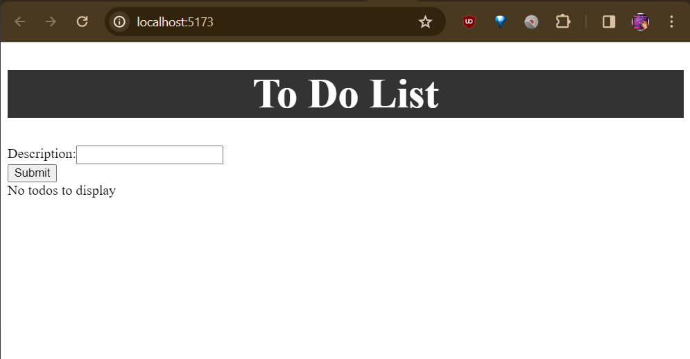

# Full Stack To-Do List App ☑️

## Demo & Snippets

Documentation image for the inital app before the design stage.



## Requirements / Purpose

- MVP
- purpose of project
- stack used and why

---

## Build Steps

backend

`Run` program in backend/src/main/java/com/example/backend/BackendApplication.java

frontend

```
npm run dev
```

---

## Design Goals / Approach

- Design goals
- why did you implement this the way you did?

---

## Features

- What features does the project have?
- list them...

---

## Known issues

- Remaining bugs, things that have been left unfixed
- Features that are buggy / flimsy

---

## Future Goals

- What are the immediate features you'd add given more time

---

## What did you struggle with?

- What? Why? How?
